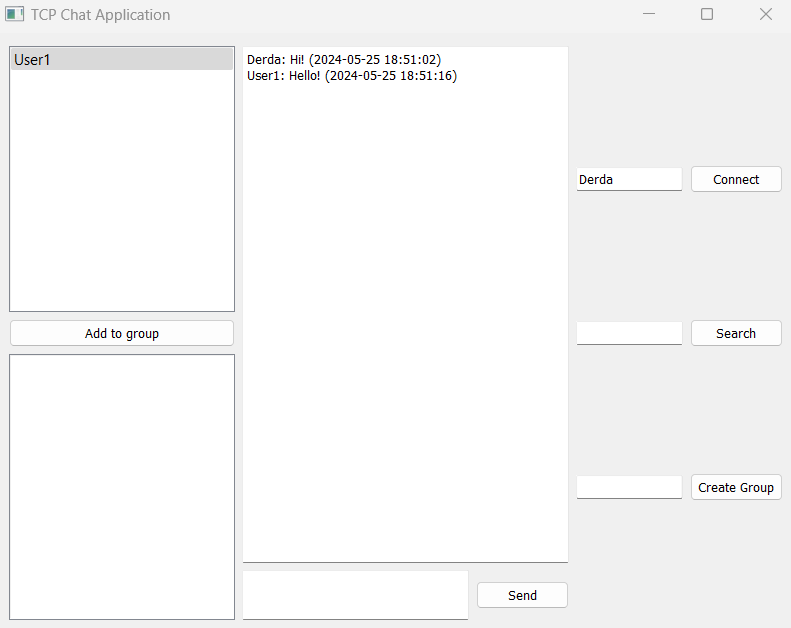

# PYTHON TCP CHAT APPLICATION

This application provides a simple chat experience using TCP sockets for communication. Users can connect to a server, chat with other connected users (or groups!), and even search their chat history.

## FEATURES

- **Individual Chat:** Private one-on-one messaging between users.
- **Group Chat:** Create and join groups to chat with multiple participants.
- **Search:** Find specific messages in your chat history.
- **Active User List:** See who's currently online.
- **Local SQLite Database:** Stores chat history for persistence.

## PROJECT STRUCTURE

- **server.py:** The TCP server that handles connections and message routing.
- **client.py:** The GUI-based chat client (PyQt5) that users interact with.
- **database.py:** Provides a SQLite database interface for storing and retrieving messages.
- **requirements.txt:** Lists the required Python packages for the project.

## INSTALLATION

1. **Clone the repository:**
    git clone https://github.com/your-username/python-tcp-chat.git
    cd python-tcp-chat

2. **Install dependencies:**
    git clone https://github.com/your-username/python-tcp-chat.git
    cd python-tcp-chat

## USAGE

1. **Start the Server:**
    python server.py

2. **Start the Client:**
    python client.py

3. **Connect:**
    - Enter your desired username in the "Username" field and click "Connect."
    - The client will show you a list of online users and groups you can join.

4. **Chatting:**
    - Click on a user or group to initiate a conversation.
    - Type messages in the input box and hit "Send."
    - The chat history will be displayed in the main text area.

5. **Groups:**
    - Create new groups by typing a name in the "Create Group" field and clicking the button.
    - Add users to a group by selecting the user and group and then clicking "Add to group."

6. **Searching:**
    - Enter a keyword in the "Search" field and click the "Search" button.
    - Matching messages will be shown in the main text area.

## REQUIREMENTS
    • Python 3.x
    • PyQt5 (for the GUI)
    • SQLite3 (for the database)

## CONFIGURATION
    • Server Address/Port: You can change the default server host and port in the client.py file.
    • Database Name: The database is created/stored in a folder named after the username you enter when connecting with the client.

## SECURITY NOTE
    This application is designed for educational purposes and doesn't include encryption. Do not use it to transmit sensitive information in an untrusted environment.

